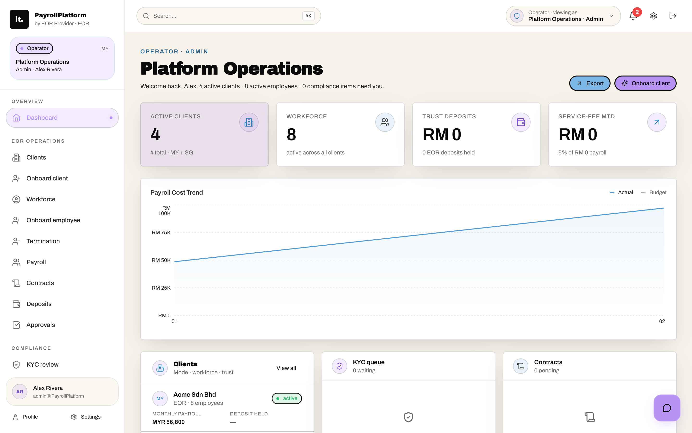

<div align="center">

# Stablecoin Payroll

### Run Malaysia- and Singapore-compliant payroll and EOR, pay your team in stablecoins, and skip the bank-wire FX.

<a href="#"></a>
<a href="#"></a>
<a href="#license"></a>

</div>

<div align="center"></div>

---

A multi-tenant SaaS / Employer-of-Record (EOR) platform that runs Malaysia- and Singapore-compliant payroll — statutory contributions, contracts, KYC, and a double-entry trust-account ledger — for an operator and its client companies, and settles employee pay in stablecoins at a flat **$0.01** fee instead of bank-wire FX.

Built for founders and developers shipping payroll, EOR/PEO, or HR-tech products for APAC, and for crypto-payroll and remote-first teams that need accurate Southeast Asian compliance behind a stablecoin front end. It's a real working codebase, not a slideshow: clone it, seed it, and click through a complete operator + client + employee product in minutes — log in as any of 11 seeded personas and watch the server-side tenant scoping actually change under you.

## What you can build

- **Crypto payroll for a distributed MY/SG team.** Pay employees and contractors in stablecoins while EPF/SOCSO/EIS/PCB and CPF/SDL/FWL math stays correct, with payslips and contracts generated as real PDFs.
- **A white-label EOR/PEO platform.** Employ staff across SEA on behalf of client companies, with trust-deposit collateral sized from `(gross + fixed allowances) × notice-period months`, auto-draw of gross + employer statutory on payroll approval, operator-bills-client invoicing, and refund-on-termination already wired end to end.
- **A Malaysian or Singaporean payroll bureau.** Run monthly statutory calculations and export the exact LHDN, KWSP, PERKESO, HRD Corp, and IRAS (IR8A / IR21 / AIS) submission files in the byte-precise formats the agency portals accept.
- **A multi-tenant HR/payroll SaaS.** Operator, client, and employee dashboards, RBAC, JWT auth, tenant isolation, and audit logs out of the box instead of from zero — re-shaped automatically across four product tiers (payroll, HR, payroll+HR, EOR).
- **A leave + termination engine.** Statutory leave entitlement and a final-pay calculator (notice-in-lieu, unused-leave encashment, EA1955 severance, days-worked proration, EOR deposit refund) for MY/SG offboarding.
- **An investor or prospect demo.** An instant 11-persona click-through across one operator and four client tenants, with a 15-section parallax marketing site, ~15 dashboard widgets, and a data-grounded chat assistant.

## Features

### Multi-tenancy, personas, and product tiers

- **Two-level persona model with real backend auth.** 11 seeded demo personas across 5 tenants — 1 operator org plus 4 client orgs (Acme = EOR/MY, Beta = payroll+HR/MY, Gamma = payroll/SG, Delta = HR/SG). Switching persona in the PersonaSwitcher fires a **real `POST /api/auth/login`** as that seeded user, so the JWT carries the correct `tenantId`/`clientId` and server-side row scoping genuinely changes. It is not a client-side role toggle — switching to "Acme HR" logs in as `hr@acme.my` and the server filters the rows accordingly. Child views stay gated behind a "Signing in as…" spinner until auth completes, so dashboards never fire API calls with a stale token.
- **Four product tiers that re-shape the whole app.** `clients.mode ∈ {payroll, hr, payroll_hr, eor}`. `navFor()` derives the entire sidebar from `(orgKind, role, mode)`, and `MainApp` routes to one of five distinct dashboards (Operator, Client/EOR, PayrollOnly, HrOnly, Employee). EOR-only features (trust deposits, tripartite contracts, EOR invoices) are hidden for non-EOR tiers — Acme is full EOR, while Beta/Gamma/Delta are plain SaaS where the client is its own employer. Route gating (`canAccessModule`) and the sidebar share one source of truth to avoid drift.
- **JWT auth with bcrypt, cookie + Bearer, and tenant-scoped queries.** `jose` HS256 JWT (7-day expiry); the server refuses to boot without `JWT_SECRET` (`process.exit(1)`). Tokens are read from the `Authorization: Bearer` header or the `payroll_token` cookie. Legacy `admin` role is normalized to `super_admin`. `buildTenantScope()` returns a Drizzle `WHERE` clause — `super_admin` is unrestricted, everyone else is scoped by `clientId`/`tenantId`. `requireRole()` middleware gates routes, `super_admin` passes every check, and guest login mints an ephemeral `super_admin` operator user.

### Statutory compliance engines

- **Malaysia statutory engine (server, authoritative).** `server/services/statutory/my.ts`: EPF (foreign 2%/2% post-Oct-2025; MY/PR <60 EE 11% / ER 13% ≤RM5k else 12%; 60+ EE 0% / ER 4%, no ceiling), SOCSO Cat-1 0.5%/1.75% and Cat-2 (foreign/60+) ER 1.25% capped RM6,000, EIS 0.2%/0.2% capped RM6,000 (citizens/PR <60 only), HRD Corp 1% employer levy gated on `hrdfEligible`, PCB/MTD with 2025 progressive brackets plus KA1/KA2/KA3 reliefs, RM4k EPF relief cap, child relief, and zakat/CP38 offsets, and a foreign non-resident flat 30% withholding.
- **Singapore statutory engine (server, authoritative).** `server/services/statutory/sg.ts`: CPF age-band table (5 bands × 3 nationality classes — citizen/full-PR, first-2-years-PR graduated, foreign = 0) with the 2026 OW ceiling of S$8,000/mo and S$102,000 annual AW ceiling using rolling YTD-OW deduction; SDL 0.25% capped S$11.25 (min S$2, all employees including foreigners); FWL of S$330 (S Pass) / S$300 (Work Permit); and an `ageOnFirstOfMonth()` helper for the birthday-following-month rate switch.
- **Separate client-side Malaysian engine, live in the payroll grid.** `client/src/lib/statutoryDeductions.ts` independently recomputes EPF/SOCSO/EIS/PCB/WHT/HRDF per employee in the browser (Math.ceil rounding, headcount-based HRDF 1% vs 0.5%, non-resident 30% WHT, PCB rounded to the nearest 5 sen). `PayrollView` renders per-employee gross→net tables, employer-contribution cards, total cost-to-company, and a compliance tab listing each scheme's portal (i-Akaun/e-Caruman, PERKESO ASSIST, MyTax e-CP39, HRD Corp) with due dates.
- **Multi-country dispatcher beyond MY/SG.** `StatutoryService.calculateDeductions` switches on country: MY, SG, US (Social Security 6.2% to wage base, Medicare 1.45%, simplified federal brackets + per-state rates for CA/TX/FL/NY/IL), ID (BPJS Ketenagakerjaan + Kesehatan), TH (SSF 5% capped THB15k), KR (NPS 4.5% + NHI 3.545%), and JP (Kosei Nenkin 9.15% + Kenko Hoken ~5%). The `statutory_rates` enum covers 18 countries.

### Government filing exporters

- **Malaysia filing-file generators with exact agency layouts.** `GET /api/statutory/filings/:format` streams downloadable files: LHDN e-PCB (pipe-delimited CP39 with a totals footer), KWSP e-Caruman (**fixed-width 80-char records** — NRIC 12 / name 40 / EE & ER cents 8 / wage 6, with H header + T footer), PERKESO ASSIST (CSV SOCSO_EE/ER + EIS_EE/ER), and HRD Corp e-TRiS (CSV levy). They aggregate real payslip rows for the period, are tenant-scoped and role-gated (`super_admin`/`client_admin`/`finance`/`hr`), and run for MY clients only. Zero-contribution employees are skipped and HRD Corp excludes foreign workers — matching real filing rules.
- **IRAS annual-filing engine (Singapore).** `server/services/iras.ts` generates IR8A (Return of Remuneration), Appendix 8A (benefits-in-kind valuation), Appendix 8B (share-scheme gains), IR21 (foreign-employee tax clearance — validates the ≥30-days-before-cessation rule and computes the monetary amount held back), and AIS export in **both CSV and legacy XML** (16-column AIS spec, UEN envelope, proper CSV/XML escaping). `checkSgEorEligibility()` implements the MOM Sep-2024 advisory that blocks EOR work-pass sponsorship for foreigners.

### EOR money mechanics

- **Trust-deposit system with an immutable double-entry ledger.** Deposit amount = `(gross salary + sum of fixed allowances) × notice-period months`. The flow is `createPendingDepositForEmployee → markDepositReceived` (writes a `receive` ledger entry) `→ drawFromDeposit` (`draw`) `→ refundDeposit` (`refund`). `deposit_ledger` is append-only (`receive`/`draw`/`top_up`/`refund`) and the balance is reconstructed by replaying entries. `POST /deposits/quote` previews the amount; draw/refund are role-gated (`super_admin`/`finance`); and an operator-only cross-client ledger (`GET /deposits/ledger/all`) joins client names.
- **Automated EOR billing + deposit auto-draw on approval.** `PATCH /payroll/runs/:id/status === 'approved'` fires two hooks for EOR clients: (1) `generateClientInvoiceForPayrollRun` builds an idempotent 3-line invoice (gross payroll pass-through + employer statutory pass-through + service fee % of gross), currency MYR/SGD by client country, 7-day due; (2) `autoDrawDepositForPayrollRun` draws gross + employer statutory per employee from their received deposit. Both are wrapped in try/catch so payroll status still updates if a hook fails.
- **Final-settlement / termination calculator.** `POST /api/settlement/final` computes pro-rata salary to the last day + unused-leave encashment + notice-in-lieu + MY statutory severance (EA1955 10/15/20 days × completed years × wage/30, employer-initiated only) + termination benefits + EOR deposit refund (auto-refunds the remaining trust balance and records the ledger entry). Country-aware (SG uses `contractualSeverance`), with a dedicated `TerminationView`.
- **Leave-entitlement engine (MY + SG).** `calculateLeaveEntitlement`: MY (EA1955 — annual 8/12/16 by tenure, sick 14/18/22, hospitalisation 60, maternity 98, paternity 7 capped at 5 confinements) and SG (annual 7 +1/yr cap 14, sick 14 outpatient / 60 hospitalisation, maternity 16wk citizen else 12, paternity 2wk, childcare 6d). `proRateDays()` rounds to the half-day.

### Contracts, documents, and identity

- **Versioned contract templates + tripartite in-app e-signature.** 4 seeded templates (MY tripartite / employee-info / termination, SG tripartite Key Employment Terms) with `{{variable}}` substitution from employee + client + operator context. `generateContract` renders the body; `addSignature` enforces **one signature per party** (operator + client + employee — all three), auto-advances status `draft → partially_signed → signed`, and stamps `completedAt` when all three sign, capturing signer name/email/timestamp/IP/method. A pluggable `ESignatureProvider` interface ships with InAppTyped (default) plus DocuSign/Adobe stubs.
- **Real PDF generation (pdfkit) for payslips, contracts, settlements.** `PDFService` renders A4 PDFs server-side: payslips (earnings/deductions/summary, zero rows stripped, MY+US+SG deduction labels), contracts (a markdown-ish parser for `#`/`##`/`-`/`---` plus a signature block with IP/method audit), and settlement reports, with batch payslip generation per payroll run. PDFs upload to S3 and are recorded in `generated_pdfs` with download-count tracking and signed-URL retrieval; when S3 is unconfigured, the contract PDF gracefully falls back to a base64 payload the browser opens.
- **S3 document storage with a KYC review workflow.** `multer` in-memory upload (10MB), MIME + extension cross-validation (pdf/jpg/png), AES256 server-side encryption, keyed `documents/{userId}/{type}/{ts}-{rand}`. 8 document types including 5 `kyc_*` categories. An operator-only KYC queue (`GET /documents/kyc/queue`, gated to `super_admin` or operator-tenant `hr`) joins user + company; `PATCH /:id/verification` verify/reject stamps the reviewer and writes an audit log. Soft-delete plus signed download URLs (1hr) with audit logging.
- **Liveness / identity-verification service (provider-pluggable).** `LivenessService` with a `LivenessProvider` interface (idology / onfido / aws_rekognition); the `liveness_checks` table stores session, score, and pass/fail. Endpoints for initialize/verify/result/history/latest/verified, and employee onboarding sends a liveness link to the candidate's email. Ships with `MockLivenessProvider` (always passes, 0.98 confidence).

### Stablecoin treasury and FX

- **Wallets, swaps, sends, and yield deposits.** 5 seeded stablecoins (USDC, MYR, xSGD, EURC, USDT) with real mainnet contract addresses and prices. FX rates are derived as price ratios (`GET /fx/rates`). `platform_transactions` logs send/swap/receive with a flat **$0.01** `platformFee`, and `treasury_deposits` track yield (5% default, `yieldEarned`). PayrollView's "Send Payroll" fires one `transactions.send` per active employee with **resumable** progress (`done/total`) — the error copy explicitly tells you to re-run to continue where it stopped. The FX view executes swaps against live ratio rates.

### Back office and analytics

- **Full accounting suite.** Chart of accounts (asset/liability/equity/revenue/expense, 10 seeded), journal entries + line items (debit/credit, approval workflow), customers + invoices + line-items + payments (multi-currency, status lifecycle `draft → sent → viewed → partially-paid → paid → overdue`), and vendors + bills (AP). AccountingView/InvoicingView/BillPayView UIs, plus a client-side `accountingIntegrationService` that builds GL entries from payroll, invoicing, expense, settlement, and treasury events.
- **Expenses with OCR receipt processing.** `expenses` (`draft → submitted → approved → rejected → reimbursed`), receipts with OCR fields (vendor/amount/date/category). The client `ocrService` auto-categorizes by vendor keyword into GL accounts (office/travel/meals/utilities/software) with confidence scores. ExpensesView, MyExpensesView, and a `useDocumentUpload` hook.
- **Approvals, automation rules, webhooks, integrations.** A unified `approvals` table (expense/pto/payroll/payment/invoice, priority, tenant-scoped); `automation_rules` (trigger/conditions/actions JSON, `runCount`); `webhook_endpoints` with a generated 32-char secret, URL validation, a default event set, and per-user ownership checks; and `integrations` (xero/quickbooks/stripe/plaid). A client `automationService` models recurring-payroll, invoice-reminder, tax-filing, and expense-auto-approve rules on cron schedules.
- **Operator admin analytics + dashboard widgets.** The `admin-analytics` service produces payroll summaries by country/currency, payroll-run details, employee payroll history + 12-month trends, per-run deduction breakdowns, settlement analytics (fees, by status/currency), employee distribution, and top earners. Dashboards compose ~15 widgets including GrossToNetWaterfall, PayrollCostTrend, SettlementSavingsHero, PlatformVsWiseSavings, StatutoryFilingStatus, TrustDepositCard, and TopEarnersBubble.
- **Context-aware AI chat assistant (rules-based, data-grounded).** A floating `ChatSidebar` (framer-motion spring-in) persists `chat_messages` per user. `generateAIResponse` keyword-routes to **live DB queries** — payroll (active employee count, latest run, net pay), invoices (outstanding/overdue), expenses (pending), treasury (wallet balances + yield), bills, help, customization — returning markdown answers with real numbers. It is deterministic intent matching over real data, **not an LLM call**.

### Presentation and platform

- **Custom physics bubble chart (no chart lib).** `PhysicsBubbleChart.tsx` is a hand-written collision/damping/mouse-repulsion simulation on a `requestAnimationFrame` loop, with value-sized SVG bubbles that drift — used for the top-earners and currency-holdings visualizations.
- **Full marketing landing page + in-app polish.** `HomePage` composes 15 React sections (Hero, Pain, Features, Countries, HowItWorks, Payroll, Culture, Stats, Pricing, Testimonials, Integrations, PlatformPreview, FAQ, FooterCTA) with scroll-parallax, 60+ hand-doodle SVG assets, and integration logos (Xero, QuickBooks, MYOB, Sage, Maybank, Kakitangan, Employment Hero). In-app: a CMD+K command palette, notification center, mobile menu, and a hand-drawn "doodle" design system.
- **Self-managing SQLite schema with idempotent migrations.** `server/index.ts` creates ~30 tables via `CREATE TABLE IF NOT EXISTS`, runs ~50 idempotent `ALTER TABLE ADD COLUMN` statements guarded by duplicate-column try/catch (so old DBs upgrade in place), then auto-seeds when the `users` table is empty. The libsql client works as a local `file:./dev.db` or as remote Turso via `DATABASE_URL`/`DATABASE_AUTH_TOKEN`.

## Tech stack

- **Frontend** — React 19, Vite 7, TypeScript, Tailwind v4, `wouter` routing, framer-motion, recharts, lucide, axios.
- **Backend** — Express 4 + Drizzle ORM over libsql/SQLite (local file or Turso), `jose` JWT + `bcryptjs` auth, `multer` + AWS S3 (lib-storage / presigner), pdfkit (and a puppeteer dependency) for PDFs, nanoid/uuid, zod.
- **Tooling** — vitest tests; build via Vite + esbuild bundle; pnpm.

## Quickstart

```bash
git clone <your-fork-url> stablecoin-payroll
cd stablecoin-payroll
pnpm install

cp .env.example .env
# Set JWT_SECRET — the server refuses to boot without it.
# Optionally pin SEED_PASSWORD + VITE_DEMO_PASSWORD so persona auto-login is repeatable.

pnpm db:seed     # seed tenants, personas, employees, wallets, coins
pnpm dev:all     # API on :3001 + Vite client
```

Open the app and use the PersonaSwitcher to log in as any of the 11 seeded users. It defaults to local SQLite, so no external services are needed to explore. The schema self-migrates and auto-seeds on first boot.

## Configuration

All config is environment-driven. Copy `.env.example` to `.env` and fill what you need.

| Variable | Required | Purpose |
| --- | --- | --- |
| `JWT_SECRET` | Yes | Signs auth tokens. The server exits on boot if it's missing. Generate a random 32-byte hex value. |
| `DATABASE_URL` | Yes | `file:./dev.db` for local SQLite, or a `libsql://` URL for remote Turso/libsql. |
| `DATABASE_AUTH_TOKEN` | For remote DB | Auth token for remote libsql/Turso. Blank for a local file DB. |
| `SEED_PASSWORD` / `VITE_DEMO_PASSWORD` | No | Pin the demo seed password (they must match) so the PersonaSwitcher auto-login works. Otherwise the seed prints a random password. |
| `OPERATOR_TENANT_ID` / `OPERATOR_NAME` | No | Platform operator identity shown throughout the UI. |
| `AWS_ACCESS_KEY_ID` / `AWS_SECRET_ACCESS_KEY` / `AWS_REGION` / `AWS_S3_BUCKET` | No | Optional document storage for generated PDFs. Falls back to a base64 buffer when unset. |
| `SETTLEMENT_PROVIDER_API_URL` / `SETTLEMENT_PROVIDER_API_KEY` | No | Placeholder for your on-chain settlement adapter. **Not wired yet** — see Status. |
| `SMTP_HOST` / `SMTP_PORT` / `SMTP_USER` / `SMTP_PASS` / `FROM_EMAIL` | No | Optional outbound email. Without it, notifications log to the console. |
| `PORT` | No | Server port. |

## Make it yours

1. **Add a country.** Drop a new statutory engine into `server/services/statutory/` alongside `my.ts` and `sg.ts` and register it in the dispatcher. US, ID, TH, KR, and JP already exist as simplified dispatcher cases you can deepen.
2. **Wire real settlement.** Implement an adapter behind `SETTLEMENT_PROVIDER_API_*` to sign and broadcast actual on-chain stablecoin transfers, then replace the `platform_transactions` rows with real settlement state.
3. **Plug in live FX.** Swap the seeded stablecoin price table for a live market feed; the `GET /fx/rates` ratios and the FX view update from it.
4. **Turn on real providers.** Replace `MockLivenessProvider`, `MockNotificationProvider`, and the mock OCR with Onfido/IDology/Rekognition, SMTP, and a real OCR engine; wire the DocuSign/Adobe e-signature adapters and the xero/quickbooks/stripe/plaid integrations.
5. **Harden auth.** The demo ships email + password + a PersonaSwitcher; add SSO, MFA, or magic-link for production.
6. **Rebrand.** Set `OPERATOR_NAME` and restyle the Tailwind/doodle design system to your white-label.
7. **Go to production.** Point `DATABASE_URL` at a managed libsql/Turso DB and provide a host Chromium if you enable the Puppeteer path.

## Status — what's real vs stubbed

This template is honest about what's real. The compliance engines, EOR money mechanics, and the multi-tenant app are genuinely implemented; the on-chain and external-provider parts are scaffolding you complete.

- **Stablecoin payments are simulated.** `send`/`swap` just insert `platform_transactions` rows with a flat $0.01 fee and an `employee:{id}` pseudo-address. There is no real chain, wallet, or settlement provider — `SETTLEMENT_PROVIDER_API_URL`/`_KEY` are empty placeholders. FX rates are simple price ratios from seeded coin prices.
- **The core is Malaysia + Singapore, not US.** MY (EPF/SOCSO/EIS/PCB/HRDF/zakat/CP38) and SG (CPF/SDL/FWL/IRAS) are authoritative; US/ID/TH/KR/JP exist only as additional dispatcher cases. The schema still carries legacy US fields (federal/state/SS/medicare/401k).
- **E-signature: only the in-app typed path works.** The DocuSign and Adobe adapters are stubs that throw "not yet wired."
- **Liveness and KYC scanning are mocked.** `MockLivenessProvider` always passes (0.98 confidence); there's no real Onfido/IDology/Rekognition. `virus_scan_status` is a column that stays `pending` (no scanner).
- **OCR is mock.** `ocrService.generateMockReceipt` fabricates random vendor/amount/confidence — no real OCR engine.
- **Several client-side services are in-memory mocks.** `accountingIntegration`, `automationService`, `fxReportingService`, and `ocrService` are singletons with mock tokens and `console.log` side effects; Xero/QuickBooks "connect" returns fake tokens and isn't persisted to the backend.
- **Integrations and webhooks store config but don't call out.** xero/quickbooks/stripe/plaid and webhook endpoints save settings but don't hit external APIs or deliver payloads (`lastDeliveryAt` stays null).
- **Notifications log only.** Email/SMS use `MockNotificationProvider` (console only) unless SMTP is configured.
- **Tax math is a starting engine, not a certified calculator.** PCB/MTD and US federal tax are explicitly simplified approximations, not the official LHDN/IRS calculators; SG context derives age/work-pass from coarse proxies (`ageGroup → 30/65`) because the employee schema lacks DOB and work-pass fields. Statutory rates are point-in-time (2025/2026 reference values) and need ongoing maintenance.
- **Some dashboard metrics are partly hardcoded** (e.g. `nextPayrollDate`, `payrollAccuracy` 99.8%, `cashFlow = balance × 0.09`).
- **Some files are not wired in.** `LandingPage.tsx` (the DOM-injection home variant) is dead code — `App.tsx` routes `/` to the React `HomePage` — and `Login.tsx` isn't in routing (entry to `/app` is via persona auto-login). The statutory-rates CRUD seed cosmetically mislabels EIS under scheme `hrdf` and PCB under `federal_tax`; the real math lives in the dedicated engines, not those rate rows.
- **Filing files are generated, not submitted.** The generators produce correct formats; portal authentication and upload are out of scope — an operator still logs into each agency portal and uploads manually.
- **All data is seeded mock data** until you wire real sources, and it defaults to local SQLite. Production needs a managed libsql/Turso DB.

## License

MIT © 2026
